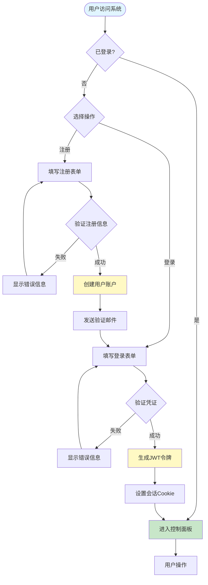
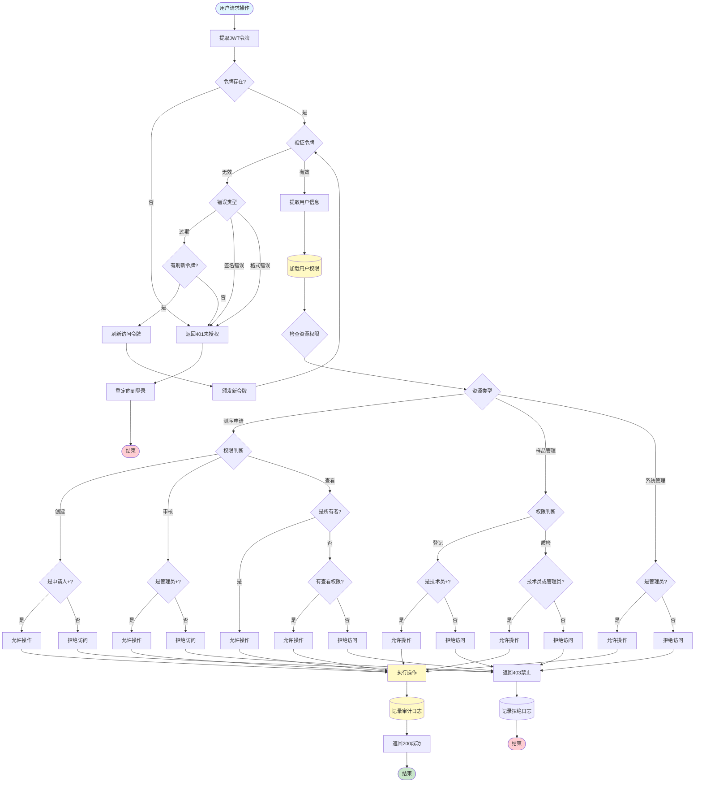
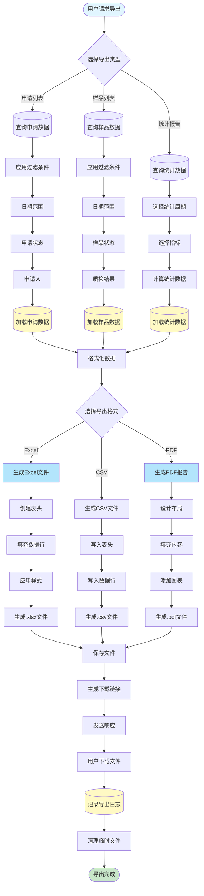
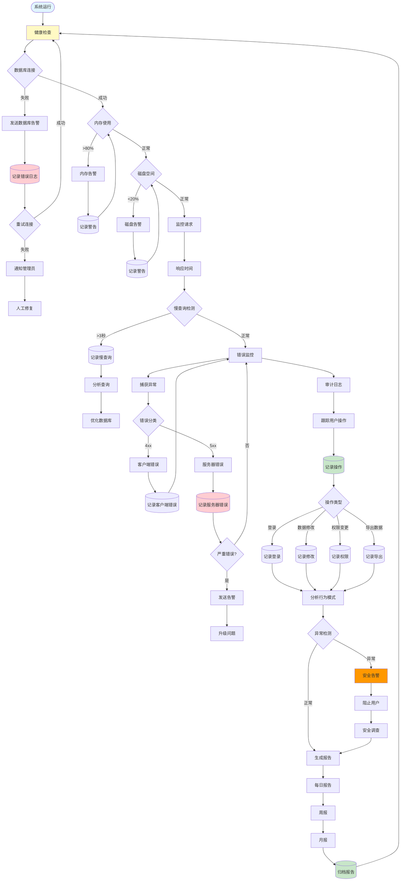
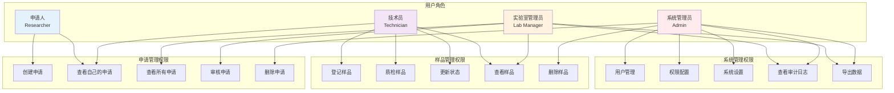

# SAMS 业务流程图

本文档使用 Mermaid 图表描述测序申请管理系统的核心业务流程。

## 1. 用户注册与登录流程

## 2. 测序申请完整流程

```mermaid
flowchart TD
    Start([申请人发起申请]) --> CheckRole{验证用户角色}
    CheckRole -->|无权限| AccessDenied[拒绝访问]
    CheckRole -->|有权限| FillForm[填写申请表单]
    
    FillForm --> InputBasicInfo[基本信息<br/>项目名称、申请人]
    InputBasicInfo --> InputSampleInfo[样品信息<br/>样品数量、类型]
    InputSampleInfo --> InputSeqParams[测序参数<br/>平台、策略、深度]
    InputSeqParams --> AddAttachments[上传附件<br/>实验方案等]
    
    AddAttachments --> ValidateForm{表单验证}
    ValidateForm -->|失败| ShowErrors[显示验证错误]
    ShowErrors --> FillForm
    
    ValidateForm -->|成功| SubmitApp[提交申请]
    SubmitApp --> SaveToDB[(保存到数据库)]
    SaveToDB --> NotifyManager[通知实验室管理员]
    NotifyManager --> StatusPending[状态: 待审核]
    
    StatusPending --> ManagerReview{管理员审核}
    ManagerReview -->|拒绝| RejectApp[拒绝申请]
    RejectApp --> NotifyResearcher1[通知申请人]
    NotifyResearcher1 --> CanRevise{允许修改?}
    CanRevise -->|是| FillForm
    CanRevise -->|否| EndRejected([申请结束])
    
    ManagerReview -->|批准| ApproveApp[批准申请]
    ApproveApp --> StatusApproved[状态: 已批准]
    StatusApproved --> NotifyTech[通知技术员]
    NotifyTech --> AssignTech[分配技术员]
    
    AssignTech --> TechReceive[技术员接收任务]
    TechReceive --> StatusProcessing[状态: 处理中]
    StatusProcessing --> RegisterSamples[登记样品]
    
    RegisterSamples --> GenerateBarcode[生成样品条码]
    GenerateBarcode --> QualityCheck{样品质检}
    QualityCheck -->|不合格| NotifyQCFail[通知质检失败]
    NotifyQCFail --> ContactResearcher[联系申请人]
    ContactResearcher --> ResendSample{重新送样?}
    ResendSample -->|是| RegisterSamples
    ResendSample -->|否| EndQCFailed([申请结束])
    
    QualityCheck -->|合格| UpdateQCPass[更新质检通过]
    UpdateQCPass --> LibraryPrep[文库制备]
    LibraryPrep --> Sequencing[上机测序]
    Sequencing --> DataAnalysis[数据分析]
    DataAnalysis --> StatusCompleted[状态: 已完成]
    
    StatusCompleted --> GenerateReport[生成测序报告]
    GenerateReport --> NotifyResearcher2[通知申请人]
    NotifyResearcher2 --> DeliverResults[交付结果]
    DeliverResults --> EndSuccess([申请完成])
    
    style Start fill:#e1f5ff
    style EndSuccess fill:#c8e6c9
    style EndRejected fill:#ffcdd2
    style EndQCFailed fill:#ffcdd2
    style SaveToDB fill:#fff9c4
    style Sequencing fill:#b3e5fc
```

## 3. 样品管理流程

```mermaid
flowchart TD
    Start([技术员登录系统]) --> ViewPending[查看待处理申请]
    ViewPending --> SelectApp[选择申请]
    SelectApp --> ViewSamples[查看样品列表]
    
    ViewSamples --> ReceiveSamples[接收实体样品]
    ReceiveSamples --> VerifyCount{核对数量}
    VerifyCount -->|不符| ReportIssue[报告问题]
    ReportIssue --> ContactPI[联系申请人]
    ContactPI --> ResolveIssue{问题解决?}
    ResolveIssue -->|否| Reject[拒绝样品]
    Reject --> End1([结束])
    ResolveIssue -->|是| VerifyCount
    
    VerifyCount -->|相符| RegisterSample[登记样品信息]
    RegisterSample --> InputSampleID[输入样品编号]
    InputSampleID --> GenerateBarcode[生成条码标签]
    GenerateBarcode --> PrintBarcode[打印条码]
    PrintBarcode --> AttachBarcode[贴附条码]
    
    AttachBarcode --> QCTest[进行质检]
    QCTest --> MeasureConc[测定浓度]
    MeasureConc --> MeasureVolume[测定体积]
    MeasureVolume --> CheckIntegrity[检查完整性]
    
    CheckIntegrity --> RecordQC[记录质检结果]
    RecordQC --> QCResult{质检结果}
    
    QCResult -->|不合格| UpdateStatusFailed[更新状态: 质检失败]
    UpdateStatusFailed --> NotifyFailure[通知申请人]
    NotifyFailure --> WaitAction{等待处理}
    WaitAction -->|重新送样| ReceiveSamples
    WaitAction -->|放弃| End2([结束])
    
    QCResult -->|合格| UpdateStatusPass[更新状态: 质检通过]
    UpdateStatusPass --> StoreSample[样品入库]
    StoreSample --> RecordLocation[记录存储位置]
    RecordLocation --> UpdateInventory[(更新库存系统)]
    
    UpdateInventory --> WaitLibPrep[等待文库制备]
    WaitLibPrep --> RetrieveSample[取出样品]
    RetrieveSample --> LibraryPrep[文库制备]
    LibraryPrep --> LibQC[文库质检]
    
    LibQC --> LibResult{文库质检}
    LibResult -->|不合格| RetryLib{可重做?}
    RetryLib -->|是| LibraryPrep
    RetryLib -->|否| NotifyLibFail[通知文库失败]
    NotifyLibFail --> End3([结束])
    
    LibResult -->|合格| PoolSamples[样品混池]
    PoolSamples --> LoadSequencer[上机测序]
    LoadSequencer --> UpdateStatusSeq[状态: 测序中]
    UpdateStatusSeq --> MonitorRun[监控测序运行]
    MonitorRun --> SeqComplete{测序完成?}
    
    SeqComplete -->|失败| CheckRetry{可重测?}
    CheckRetry -->|是| LoadSequencer
    CheckRetry -->|否| NotifySeqFail[通知测序失败]
    NotifySeqFail --> End4([结束])
    
    SeqComplete -->|成功| UpdateStatusDone[状态: 测序完成]
    UpdateStatusDone --> ArchiveSample[样品归档]
    ArchiveSample --> EndSuccess([流程完成])
    
    style Start fill:#e1f5ff
    style EndSuccess fill:#c8e6c9
    style End1 fill:#ffcdd2
    style End2 fill:#ffcdd2
    style End3 fill:#ffcdd2
    style End4 fill:#ffcdd2
    style UpdateInventory fill:#fff9c4
    style LoadSequencer fill:#b3e5fc
```

## 4. 权限管理流程

## 5. 数据导出与报告流程

## 6. 系统监控与审计流程

## 7. 角色与权限矩阵

---

## 流程图使用说明

### 查看方式

1. **GitHub**: GitHub 原生支持 Mermaid 图表渲染
2. **VS Code**: 安装 "Markdown Preview Mermaid Support" 插件
3. **在线工具**: https://mermaid.live/ 在线编辑器

### 图表类型说明

- **flowchart**: 流程图，展示步骤和决策
- **graph**: 关系图，展示权限和角色关系
- **圆角矩形** `([文字])`: 开始/结束节点
- **菱形** `{文字}`: 决策节点
- **矩形** `[文字]`: 处理步骤
- **圆柱** `[(文字)]`: 数据库操作

### 颜色编码

- 🔵 蓝色 (#e1f5ff): 流程起点
- 🟢 绿色 (#c8e6c9): 成功结束
- 🔴 红色 (#ffcdd2): 失败/错误结束
- 🟡 黄色 (#fff9c4): 数据库/关键操作
- 🔷 浅蓝 (#b3e5fc): 特殊处理步骤

---

**文档版本**: 1.0\
**创建日期**: 2025年11月10日\
**维护团队**: SAMS 开发团队\
**更新记录**: 初始版本，包含7个核心业务流程图
