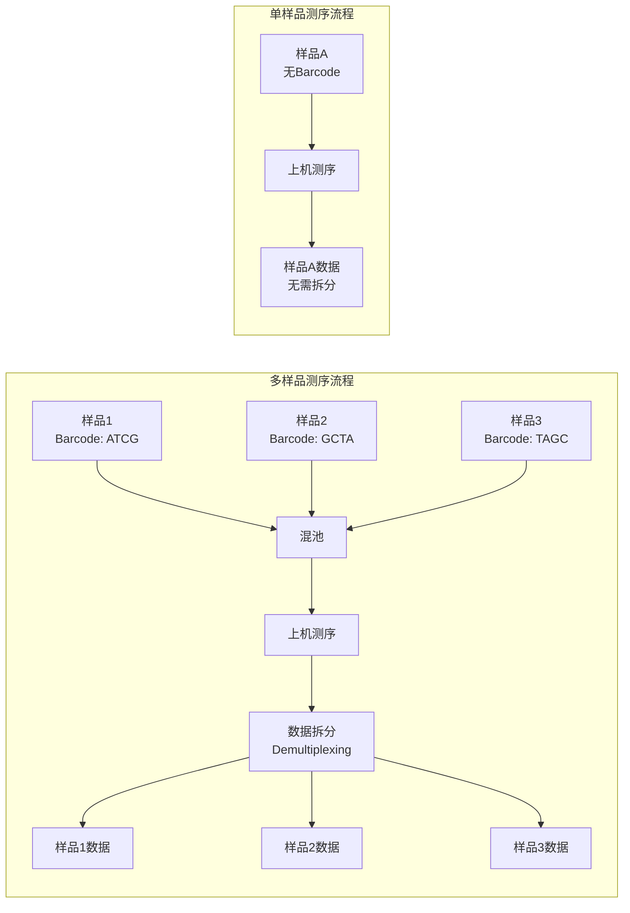
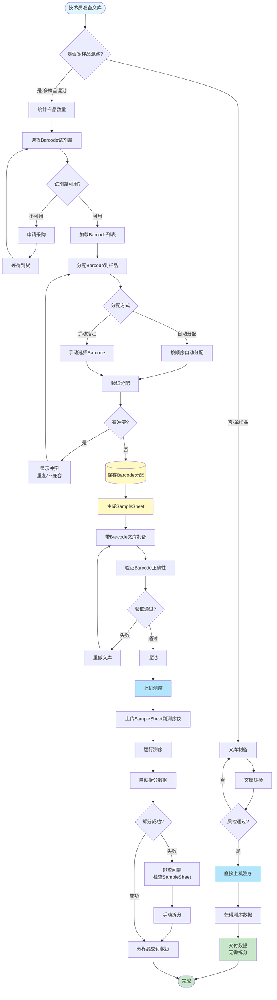
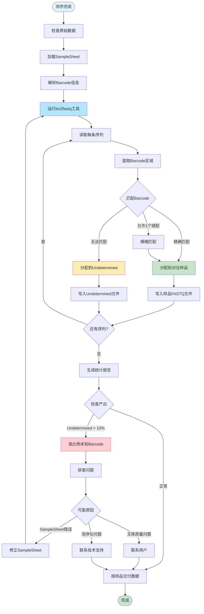

# SAMS 测序业务规范

本文档详细说明不同测序类型的特定业务流程和技术要求。

## 测序类型分类

### 高通量测序 (NGS)

- **WGS** (Whole Genome Sequencing) - 全基因组测序
- **WES** (Whole Exome Sequencing) - 全外显子组测序
- **RNA-seq** - 转录组测序
- **amplicon** - 扩增子测序（如16S rRNA）
- **ChIP-seq** - 染色质免疫沉淀测序

### Sanger 测序

一代测序技术，用于验证突变、引物延伸等小规模测序任务。

---

## 1. Sanger 测序特殊流程

### 1.1 业务特点

- **引物要求**: 每个样品必须指定至少一个引物
- **上样方式**: 使用96孔板分配样品和引物
- **数据量小**: 单个样品单个引物产生一条序列
- **快速交付**: 通常24-48小时出结果

### 1.2 申请流程

```mermaid
flowchart TD
    Start([申请人发起Sanger测序]) --> FillBasicInfo[填写基本信息]
    FillBasicInfo --> AddSamples[添加样品列表]
    
    AddSamples --> SelectPrimer{为每个样品选择引物}
    SelectPrimer -->|从引物库选择| BrowsePrimerLib[浏览引物库]
    SelectPrimer -->|自定义引物| InputPrimer[输入引物信息]
    
    BrowsePrimerLib --> FilterPrimer[筛选引物<br/>按基因/用途]
    FilterPrimer --> SelectFromList[选择引物]
    SelectFromList --> AssignPrimer[分配引物到样品]
    
    InputPrimer --> InputPrimerSeq[输入引物序列]
    InputPrimerSeq --> InputPrimerName[引物名称/描述]
    InputPrimerName --> ValidatePrimer{验证引物}
    ValidatePrimer -->|不合格| PrimerError[显示错误<br/>长度/GC含量等]
    PrimerError --> InputPrimer
    ValidatePrimer -->|合格| SavePrimer[保存引物]
    SavePrimer --> AssignPrimer
    
    AssignPrimer --> CheckComplete{所有样品都有引物?}
    CheckComplete -->|否| SelectPrimer
    CheckComplete -->|是| ReviewAssignment[预览样品-引物配对]
    
    ReviewAssignment --> SubmitApp[提交申请]
    SubmitApp --> ManagerApprove{管理员审核}
    
    ManagerApprove -->|拒绝| Rejected([申请被拒绝])
    ManagerApprove -->|批准| TechReceive[技术员接收]
    
    TechReceive --> ReceiveSamples[接收实体样品]
    ReceiveSamples --> QCCheck{质检}
    QCCheck -->|不合格| QCFailed([质检失败])
    QCCheck -->|合格| PlatePlan[设计96孔板布局]
    
    PlatePlan --> AssignWells[分配样品到孔位]
    AssignWells --> AssignPrimerWells[分配引物到孔位]
    AssignPrimerWells --> GeneratePlateMap[生成板图]
    
    GeneratePlateMap --> ReviewPlate{检查板图}
    ReviewPlate -->|需调整| PlatePlan
    ReviewPlate -->|确认| PreparePlate[准备96孔板]
    
    PreparePlate --> LoadSamples[加样到孔板]
    LoadSamples --> LoadPrimers[加引物到孔板]
    LoadPrimers --> SealPlate[封板]
    
    SealPlate --> LoadSequencer[上机测序]
    LoadSequencer --> RunSequencing[运行测序程序]
    RunSequencing --> DataQC[数据质控]
    
    DataQC --> QCPass{质量合格?}
    QCPass -->|不合格| CheckRerun{可重测?}
    CheckRerun -->|是| LoadSequencer
    CheckRerun -->|否| PartialFail[标记失败样品]
    PartialFail --> GenerateReport
    
    QCPass -->|合格| GenerateReport[生成测序报告]
    GenerateReport --> NotifyUser[通知申请人]
    NotifyUser --> DeliverData[交付序列文件]
    DeliverData --> End([完成])
    
    style Start fill:#e1f5ff
    style End fill:#c8e6c9
    style Rejected fill:#ffcdd2
    style QCFailed fill:#ffcdd2
    style GeneratePlateMap fill:#fff9c4
    style LoadSequencer fill:#b3e5fc
```



### 1.3 引物管理

#### 引物库表结构

```typescript
interface Primer {
  id: string;
  name: string; // 引物名称，如 "M13F"
  sequence: string; // 引物序列 (5'->3')
  tm: number; // 熔解温度 (°C)
  gc_content: number; // GC含量 (%)
  length: number; // 长度 (bp)
  gene_target?: string; // 目标基因
  purpose?: string; // 用途说明
  is_public: boolean; // 是否公开（引物库）
  created_by: string; // 创建者
  created_at: Date;
}
```

#### 引物验证规则

- **长度**: 18-30 bp
- **GC含量**: 40-60%
- **Tm**: 55-65°C
- **序列**: 只能包含 A, T, G, C
- **3'端**: 避免连续3个以上相同碱基

### 1.4 96孔板布局

#### 板位命名规则

```
    1   2   3   4   5   6   7   8   9  10  11  12
A  A1  A2  A3  A4  A5  A6  A7  A8  A9 A10 A11 A12
B  B1  B2  B3  B4  B5  B6  B7  B8  B9 B10 B11 B12
C  C1  C2  C3  C4  C5  C6  C7  C8  C9 C10 C11 C12
D  D1  D2  D3  D4  D5  D6  D7  D8  D9 D10 D11 D12
E  E1  E2  E3  E4  E5  E6  E7  E8  E9 E10 E11 E12
F  F1  F2  F3  F4  F5  F6  F7  F8  F9 F10 F11 F12
G  G1  G2  G3  G4  G5  G6  G7  G8  G9 G10 G11 G12
H  H1  H2  H3  H4  H5  H6  H7  H8  H9 H10 H11 H12
```

#### 板图数据结构

```typescript
interface PlateLayout {
  id: string;
  request_id: string;
  plate_number: number; // 第几块板（一个申请可能需要多块板）
  wells: WellAssignment[];
  created_at: Date;
  created_by: string;
}

interface WellAssignment {
  well_position: string; // A1, B2, etc.
  sample_id: string;
  sample_name: string;
  primer_id: string;
  primer_name: string;
  status: "pending" | "loaded" | "sequenced" | "failed";
}
```

#### 自动分配策略

1. **按行优先**: A1 → A12 → B1 → B12 → ...
2. **预留空白孔**: 每块板预留2-4个空白对照（一般在H10-H12）
3. **避免边缘效应**: 重要样品避开A1, A12, H1, H12
4. **重复样品**: 同一样品不同引物尽量分散放置

---

## 2. 高通量测序 Barcode 管理

### 2.1 Barcode 应用场景

**仅适用于多样品测序**：当多个样品混合在同一个 flow cell 上测序时，通过
barcode（也称 index、标签）区分样品。

**单样品测序不使用 Barcode**：如果整个 flow cell 只测一个样品，则不需要添加
barcode，文库制备后直接上机。



### 2.2 Barcode 分配流程



### 2.3 Barcode 管理规范

#### Barcode 试剂盒

```typescript
interface BarcodeKit {
  id: string;
  name: string; // 试剂盒名称，如 "Illumina TruSeq DNA CD Indexes"
  manufacturer: string; // 厂商
  barcode_count: number; // 包含的Barcode数量
  barcode_length: number; // Barcode长度
  compatible_platforms: string[]; // 兼容平台
  barcodes: BarcodeSequence[];
}

interface BarcodeSequence {
  index_number: string; // 编号，如 "A01", "B02"
  sequence: string; // Barcode序列
  sequence_i5?: string; // 双端Barcode的i5序列
  sequence_i7?: string; // 双端Barcode的i7序列
}
```

#### Barcode 分配记录

```typescript
interface BarcodeAssignment {
  id: string;
  request_id: string;
  sample_id: string;
  barcode_kit_id: string;
  index_number: string; // 使用的Barcode编号
  sequence: string; // 实际序列
  assigned_by: string; // 分配者
  assigned_at: Date;
}
```

#### 验证规则

1. **唯一性**: 同一批次测序中，每个样品的Barcode必须唯一
2. **汉明距离**: 建议Barcode之间至少有3个碱基差异
3. **GC平衡**: 同批次Barcode的GC含量尽量平衡
4. **兼容性**: Barcode必须与测序平台兼容

#### Barcode 正确性验证方法

文库制备完成后，在上机测序前需要验证 Barcode
是否正确添加到文库中。主要有以下几种方法：

##### 1. qPCR 验证（推荐）

**原理**: 使用 Barcode 特异性引物进行定量 PCR，检测文库中是否含有预期的 Barcode
序列。

**步骤**:

1. 设计针对每个 Barcode 序列的特异性引物对
2. 取少量文库作为模板进行 qPCR
3. 检查扩增曲线和 Ct 值
4. **判断标准**:
   - 预期 Barcode: Ct 值 < 25（有明显扩增）
   - 非预期 Barcode: Ct 值 > 35 或无扩增
   - 如果出现非预期 Barcode 扩增，说明 Barcode 添加错误

**优点**: 灵敏度高，可定量 **缺点**: 需要为每个 Barcode 设计引物，成本较高

##### 2. Sanger 测序验证

**原理**: 对文库进行 Sanger 测序，直接读取 Barcode 区域的序列。

**步骤**:

1. 使用通用引物（位于 Barcode 两侧的接头区域）
2. 对文库进行 Sanger 测序
3. 分析测序峰图，读取 Barcode 序列
4. **判断标准**:
   - 测序序列与预期 Barcode 完全匹配 → 正确
   - 序列不匹配或出现混峰 → 错误或污染

**优点**: 直接读序列，结果直观 **缺点**: 对于混池文库，会看到多个 Barcode
的混合信号

##### 3. Bioanalyzer/TapeStation 片段分析

**原理**: 通过电泳分析文库片段大小分布，间接验证 Barcode 是否添加。

**步骤**:

1. 使用 Agilent Bioanalyzer 或 TapeStation 分析文库
2. 检查片段大小分布图
3. **判断标准**:
   - 添加 Barcode 后，文库片段应增加 Barcode 长度（通常 6-8 bp）
   - 主峰位置应与预期大小一致
   - 无明显的引物二聚体峰（< 100 bp）

**优点**: 快速，同时可评估文库质量 **缺点**: 无法确认具体 Barcode
序列，只能确认是否添加了 Index

##### 4. 试测序验证（最可靠）

**原理**: 进行小规模测序（MiniSeq 或 MiSeq nano run），验证 Barcode 拆分效果。

**步骤**:

1. 准备少量混池文库（可以只用 2-3 个样品）
2. 进行小规模测序（读取 1-10M reads）
3. 运行数据拆分（Demultiplexing）
4. **判断标准**:
   - 每个样品都能正确拆分到对应数据
   - Undetermined reads < 5%
   - 各样品读数符合预期比例

**优点**: 最可靠，可同时验证 SampleSheet 和测序流程 **缺点**: 成本较高，耗时较长

##### 5. 数字 PCR (ddPCR) 验证

**原理**: 使用数字 PCR 技术，绝对定量文库中特定 Barcode 的拷贝数。

**步骤**:

1. 设计 Barcode 特异性探针
2. 进行 ddPCR 反应
3. 统计阳性液滴数
4. **判断标准**:
   - 预期 Barcode 应有明显阳性信号
   - 可精确定量不同 Barcode 的比例

**优点**: 绝对定量，无需标准曲线 **缺点**: 设备要求高，成本高

##### 实际应用建议

**日常质控**（成本控制）:

- Bioanalyzer 检查文库大小 + qPCR 抽查部分样品

**重要项目**（高可靠性要求）:

- Bioanalyzer + Sanger 测序 + 试测序验证

**大规模批次**（效率优先）:

- Bioanalyzer + 每批次试测序验证代表样品

**发现问题后的排查**:

- Sanger 测序确认具体错误序列
- ddPCR 定量污染程度

#### SampleSheet 格式

Illumina 平台 SampleSheet 示例：

```csv
[Header]
FileFormatVersion,2
RunName,20251107-5
InstrumentPlatform,MiSeqi100Series
IndexOrientation,Forward

[Reads]
Read1Cycles,301
Read2Cycles,301
Index1Cycles,8
Index2Cycles,8

[Sequencing_Settings]
InputContainerIdentifier,SC2086106-SC3

[BCLConvert_Settings]
SoftwareVersion,4.3.13
FastqCompressionFormat,gzip

[BCLConvert_Data]
Sample_ID,Index,Index2,OverrideCycles
F744,TCCGGAGA,TATAGCCT,R1:Y301;I1:I8;I2:I8;R2:Y301
F745,TCCGGAGA,ATAGAGGC,R1:Y301;I1:I8;I2:I8;R2:Y301
F747,AGCGATAG,TATAGCCT,R1:Y301;I1:I8;I2:I8;R2:Y301
F740,ATCACG,na,R1:Y301;I1:I6N2;I2:N8;R2:Y301
F741,CGATGT,na,R1:Y301;I1:I6N2;I2:N8;R2:Y301

[Cloud_Settings]
GeneratedVersion,2.8.0.202410292211

[Cloud_Data]
Sample_ID,ProjectName,LibraryName,LibraryPrepKitName,IndexAdapterKitName
F744,20251107-5_2025-11-07T12_17_04_ad142f1,F744_TCCGGAGA_TATAGCCT,,
F745,20251107-5_2025-11-07T12_17_04_ad142f1,F745_TCCGGAGA_ATAGAGGC,,
F747,20251107-5_2025-11-07T12_17_04_ad142f1,F747_AGCGATAG_TATAGCCT,,
F740,20251107-5_2025-11-07T12_17_04_ad142f1,F740_NNNNNNNN_ATCACGNN,,
F741,20251107-5_2025-11-07T12_17_04_ad142f1,F740_NNNNNNNN_CGATGTNN,,
```

### 2.4 数据拆分 (Demultiplexing)



---

## 3. 质量控制标准

### 3.1 Sanger 测序质量标准

- **Phred Score**: Q20 > 99%, Q30 > 95%
- **可读长度**: 通常 > 700 bp
- **信号强度**: 峰高均匀，无明显衰减
- **杂峰**: 双峰/多峰区域 < 5%

### 3.2 NGS 质量标准

- **Q30**: > 80%（取决于测序策略）
- **碱基错误率**: < 0.5%
- **接头污染**: < 0.1%
- **Barcode不明率**: < 5%
- **数据产出**: 达到预期深度（如WGS 30X）

---

## 4. 数据交付

### 4.1 Sanger 测序交付文件

- `.ab1` - 原始波形文件（ABI格式）
- `.seq` - 序列文件（FASTA格式）
- `.pdf` - 质控报告（包含波形图）

### 4.2 NGS 交付文件

- `.fastq.gz` - 原始测序数据（压缩）
- `.bam` - 比对文件（如果提供参考基因组）
- `md5sum.txt` - 文件校验码
- `QC_report.html` - 质控报告（FastQC/MultiQC）
- `SampleSheet.csv` - 样品信息表

---

**文档版本**: 1.0\
**创建日期**: 2025年11月10日\
**维护团队**: SAMS 开发团队\
**更新记录**: 初始版本，包含 Sanger 测序和 NGS Barcode 管理详细流程
